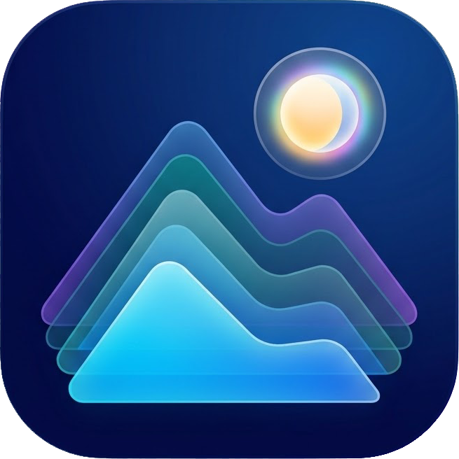
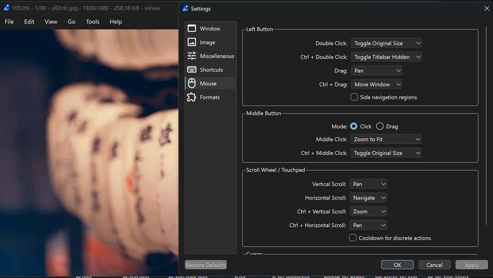

  

<h1 align="center">MithenView</h1>

MithenView is a lightweight image viewer, with basic editing feature & OCR for Windows. A Windows focused fork of <a href="https://github.com/jdpurcell/qView">jdpurcell's qView</a>, which is derived from <a href="https://github.com/jurplel/qView">jurplel's qView</a>.

## Additional features in this fork
* Windows focused features and configuration
* Follows Windows explorer sorting
* Basic editing functions (Rotate, Mirror, Flip, Crop, Quick Resize)
* OCR - Using native OcrEngine Class (Windows.Media.Ocr - WinRT Build 10240)
* Support Windows thumbnails (workaround for pesky Google Drive blocks PNG thumbnails on windows explorer)
* Adds window size modes: `Auto` (default), `Maximize`, or `Fullscreen`.
* Adds window positioning modes: `Centered` (default) or `Remember last position`, with multi-monitor and per-monitor DPI awareness.
* Adds zoom defaults `Fit`, `Fit Height`, and `Fit Width` (default), and never upscales images smaller than the viewport.
* Adds mouse gestures for navigation / zoom
* Adds an initial view position option: `Top` (default) or `Center`.
* Adds horizontal padding for portrait and square images (`0%`, `10%`, or `15%`; the default limits image width to 85% of the screen). **Manga readers, REJOICE!**
* Confines the checkerboard background strictly to the bounds of transparent images, with a fixed pattern size that pans with the image.
* Ships refined default mouse actions (double-click toggles original size, Ctrl + double-click toggles the titlebar, drag pans, Ctrl + drag moves the window, middle click zooms to fit, and more).
* Ships refined default shortcuts (`Ctrl + 0` fits and centers, `Esc` closes the window, `F11`/`Alt + Enter`/`F` toggle fullscreen); the mirror shortcut was removed.
* Restores the previous zoom level and view position when toggling original size.
* Streamlines the preferences: menubar enabled by default, verbose titlebar by default (no titlebar text in fullscreen), menu icons always shown, slideshow keep-on-top disabled by default, and deprecated or non-Windows settings removed.
* Removes the update checker. Download the newest installer if you want to update.
* Loads SVG files at their intrinsic size and re-renders them at the target resolution when zoomed, so they no longer pixelate.
* Fixes single-instance activation (no taskbar flashing or inactive titlebar when opening an image from Windows File Explorer).
* And many more!
## Screenshot

## Supported platforms
* Windows 10+ (x64 or ARM64 binaries). You may need to install the [Visual C++ runtime](https://aka.ms/vs/17/release/vc_redist.x64.exe) if you don't have it already.
## Part of MithenApps
* No telemetry
* No changing language after installation (lighter)
* No lingering background service. Closed when it's closed.
* No tracking of what "recent" files you opened. (lighter, privacy reasons)
* No update checking (use it as a tool, update it when you find issues only)
* Uninstalls cleanly, no leftovers
* Prioritizing user-ergonomics
## Credits
* [jurplel](https://github.com/jurplel) - original author of [qView](https://github.com/jurplel/qView), which MithenView is derived from.
* [jdpurcell](https://github.com/jdpurcell) - maintainer of the [qView fork](https://github.com/jdpurcell/qView) that MithenView is based on.
